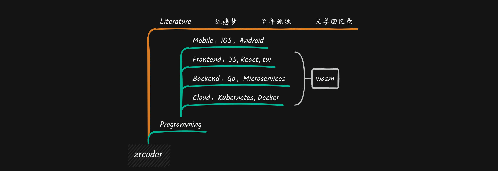

## My Profile

> [Github](https://github.com/zrcoder)

## Open source

| Project                                     | Description                               |
| :------------------------------------------ | :---------------------------------------- |
| [amisgo](https://github.com/zrcoder/amisgo) | A low code frontend package for gophers   |
| [ndor](https://github.com/zrcoder/ndor)     | Draw with codes, for kids and coders      |
| [yaqs](https://github.com/zrcoder/yaqs)     | Terminal games for learning programming   |
| [spx](https://github.com/goplus/spx)        | Go+ game engine                           |
| [cdor](https://github.com/zrcoder/cdor)     | Generate diagrams with Go+/Go code        |
| [dsGo](https://github.com/zrcoder/dsGo)     | Data structures impletioned with Go       |
| [rdor](https://github.com/zrcoder/rdor)     | Terminal games                            |
| [iCards](https://github.com/zrcoder/iCards) | An iOS UI component                       |

## My sites

- [Essays](https://yaq.netlify.app)
- [Slides](https://rd-slides.netlify.app)
