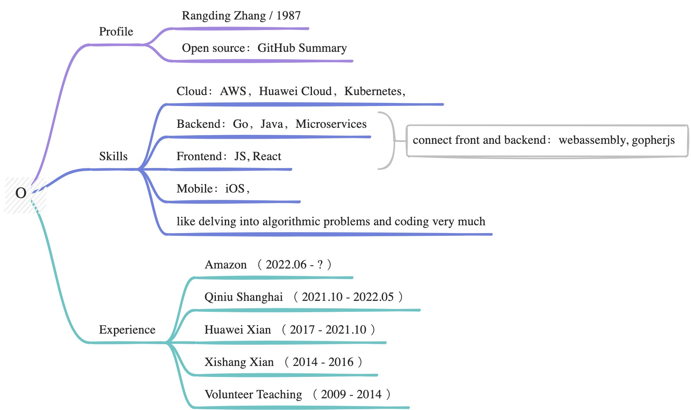

# zrcoder

## Open source

[Github Summary](https://resume.github.io/?zrcoder)

- [iCards: an iOS UI compont](https://github.com/zrcoder/iCards)

- [spx: goplus game engine](https://github.com/goplus/spx)

- [leetcode: my go solution](https://rdcode.netlify.app)

- [leetgo: Cli app to interact with Leetcode](https://github.com/zrcoder/leetgo)

- [tdoc: render markdown files in terminal as a book](https://github.com/zrcoder/tdoc)

- [dsGo: Data structures impletioned with Go](https://github.com/zrcoder/dsGo)

