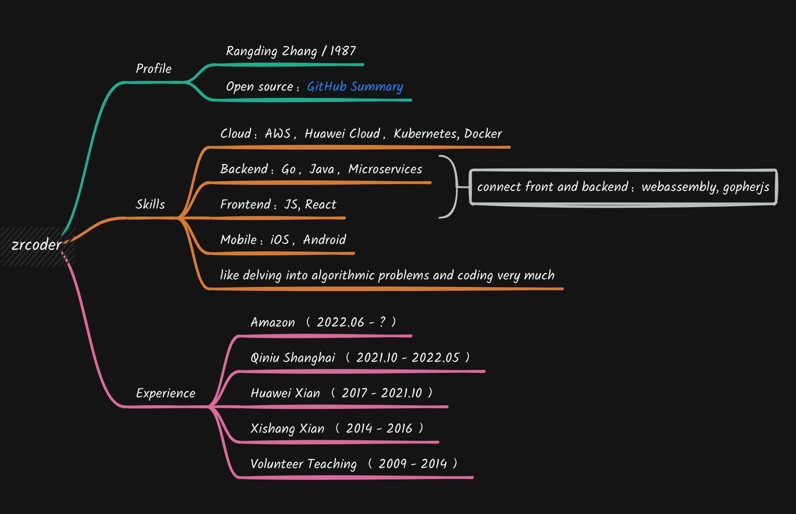

## Open source

- [iCards: an iOS UI component](https://github.com/zrcoder/iCards)

- [niudour: draw with codes, for kids and coders](https://zrcoder.github.io/niudour)

- [tdoc: render markdown files in terminal as a book](https://github.com/zrcoder/tdoc)

- [dsGo: Data structures impletioned with Go](https://github.com/zrcoder/dsGo)

- Small Games
    - [terminal games](https://github.com/zrcoder/rdor)
    - [hanoi tower for iOS](https://github.com/zrcoder/Hanoi-Tower)

- [spx: Go+ game engine](https://github.com/goplus/spx)

- [leetcode: my go solution](https://rdcode.netlify.app)

- [leetgo: Cli app to interact with Leetcode](https://github.com/zrcoder/leetgo)

## Github

[https://github.com/zrcoder](https://github.com/zrcoder)
