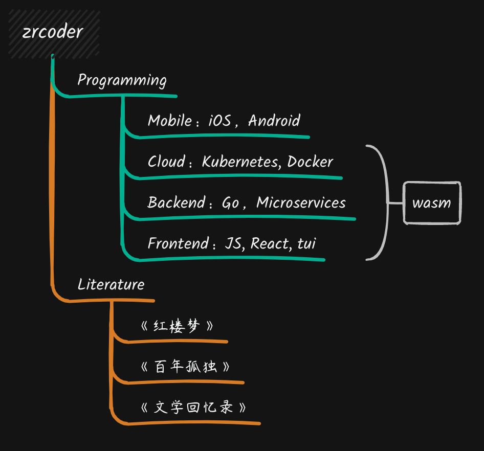

## Open source

- [iCards: an iOS UI component](https://github.com/zrcoder/iCards)
- [ndor: draw with codes, for kids and coders](https://ndor.netlify.app)
- [spx: Go+ game engine](https://github.com/goplus/spx)
- [tdoc: render markdown files in terminal as a book](https://github.com/zrcoder/tdoc)
- [dsGo: Data structures impletioned with Go](https://github.com/zrcoder/dsGo)
- Small Games
    - [terminal games](https://github.com/zrcoder/rdor)
    - [hanoi tower for iOS](https://github.com/zrcoder/Hanoi-Tower)

## My essays

<https://yaq.netlify.app>

## My Slides

<https://rd-slides.netlify.app>
