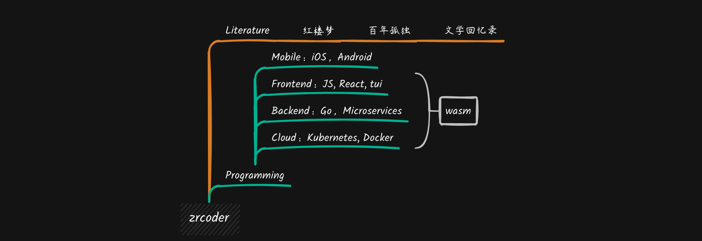

## Open source

- [iCards: an iOS UI component](https://github.com/zrcoder/iCards)
- [ndor: draw with codes, for kids and coders](https://ndor.netlify.app)
- [spx: Go+ game engine](https://github.com/goplus/spx)
- [amisgo: A low code frontend framework for gophers.](https://github.com/zrcoder/amisgo)
  
- [tdoc: render markdown files in terminal as a book](https://github.com/zrcoder/tdoc)
- [dsGo: Data structures impletioned with Go](https://github.com/zrcoder/dsGo)
- [yaqs: terminal games for learning programming](https://github.com/zrcoder/yaqs)
- [cdor: Generate diagrams with Go+/Go code](https://github.com/zrcoder/cdor)
- Small Games
    - [terminal games](https://github.com/zrcoder/rdor)
    - [hanoi tower for iOS](https://github.com/zrcoder/Hanoi-Tower)

## My sites

- [Essays](https://yaq.netlify.app)
- [Slides](https://rd-slides.netlify.app)
- [Algorithm learning](https://rdcode.netlify.app)
